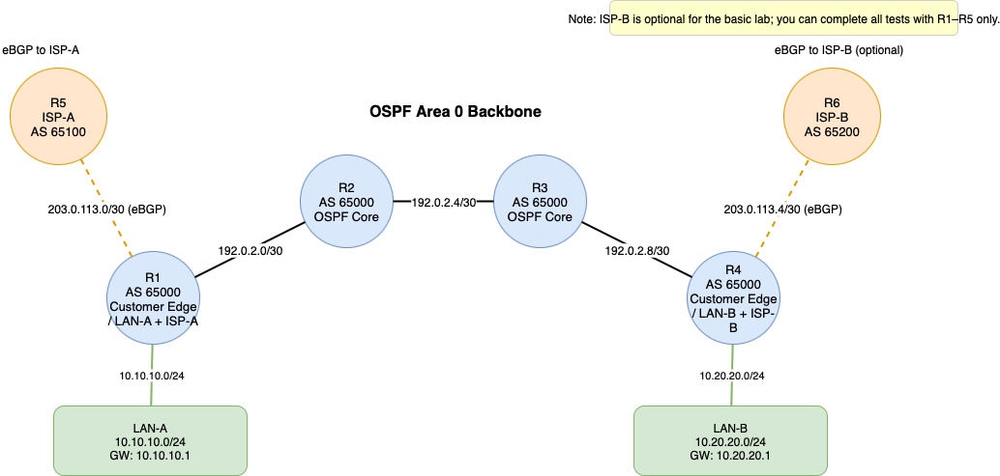

# ospf-bgp-network-lab
OSPF + BGP simulation in GNS3 (VyOS) with redistribution, default routing, and failover validation.

# OSPF + BGP Network Lab

This project demonstrates how OSPF (Interior Gateway Protocol) and BGP (Exterior Gateway Protocol) work together in a network.  
I built the lab in GNS3 using VyOS routers, designed a 4-router OSPF backbone, and configured eBGP sessions with external ISP routers.  
The project covers route redistribution, default route propagation, and failover testing.

## Project Overview
- Goal: Understand and implement OSPF + BGP routing in a simulated environment.
- Tools: GNS3, VyOS (community router), Linux.
- Key Features:
  - OSPF Area 0 backbone with 4 routers (R1–R4)
  - eBGP sessions with external ISPs (R5, R6)
  - Route redistribution between OSPF and BGP
  - Default route advertisement
  - Failover and convergence testing

## Topology



## IP Addressing Plan

| Link / Interface        | IP / Mask      | AS Number | Notes              |
|-------------------------|----------------|-----------|--------------------|
| R1–LAN-A                | 10.10.10.1/24  | 65000     | Customer LAN-A     |
| R4–LAN-B                | 10.20.20.1/24  | 65000     | Customer LAN-B     |
| R1–R2                   | 192.0.2.0/30   | 65000     | OSPF Backbone      |
| R2–R3                   | 192.0.2.4/30   | 65000     | OSPF Backbone      |
| R3–R4                   | 192.0.2.8/30   | 65000     | OSPF Backbone      |
| R1–R5 (ISP-A)           | 203.0.113.0/30 | 65100     | eBGP to ISP-A      |
| R4–R6 (ISP-B, optional) | 203.0.113.4/30 | 65200     | eBGP to ISP-B      |

## Configuration Steps

Each router was configured using VyOS CLI. Full configs are saved in the `/configs` folder.  
Below are highlights:

### R1 (Customer Edge)
```bash
set system host-name R1
set interfaces ethernet eth0 address 192.0.2.1/30     # to R2
set interfaces ethernet eth2 address 10.10.10.1/24    # LAN-A
set interfaces ethernet eth3 address 203.0.113.1/30   # to ISP-A

# OSPF
set protocols ospf area 0 network 192.0.2.0/30
set protocols ospf area 0 network 10.10.10.0/24

# BGP
set protocols bgp 65000 neighbor 203.0.113.2 remote-as 65100
set protocols bgp 65000 network 10.10.10.0/24
set protocols static route 0.0.0.0/0 next-hop 203.0.113.2
set protocols ospf redistribute static

Similar configurations were applied to R2, R3, R4, R5, and R6. Full versions are available in the `/configs` folder.
